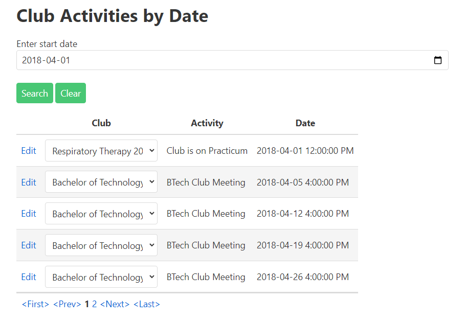

# A14: Club Activities

You must do two web form pages (Query and CRUD) based on the following database tables.


## Query

> **ClubActivities by Club** - Search with Tabular Resuits

Display the results of looking up Club Activities by the club and on or after the entered starting data. Show the Activity name and its date (see mock-up below). Display the club list in alphabetic order. Restrict the date input control to accept only dates. Include pagination to limit the number of records displayed. 
 
Add a selection column to each row for use during your CRUD processing. This link willl cause your CRUD page to appear. 

- **Search Filter:**
  - Use Club and a start date filter for main Club Activities lookup (find all activites for the club since the start date):



## CRUD

> **ClubActivities** - Single Item Create/Read/Update/Delete

Note the following:

- Only future ClubActivities can be created, updated or deleted.
- ClubActivities' `StartDate` will default to Today if no start date is given when the activity is created.
- ClubActivities will have a CampusVenue assigned unless it is on campus. A CampusVenues `Description` list can be obtained from the database. Off campus flag is off (False) and the location is null. 
- Off campus activities must be flagged on (true) and have a location.
- The active must be either a campus activity OR a off campus activity
- 
**Queries**

Cluab List

```csharp
_context.Clubs
        .OrderBy(x => x.ClubName)
```

CampusVenus List

```csharp
_context.CampusVenues
        .OrderBy(x => x.Location)
```

Cluab Activity List by club and start date

```csharp
_context.ClubActivities
        .Where(x => x.ClubId.Equals(clubid)
                 && x.StartDate >= startdate)
        .OrderBy(x => x.StartDate)
```

Cluab Activity List by activity id

```
csharp_context.ClubActivities
            .Where(x => x.ActivityId == activityid)
            .FirstOrDefault()
```
